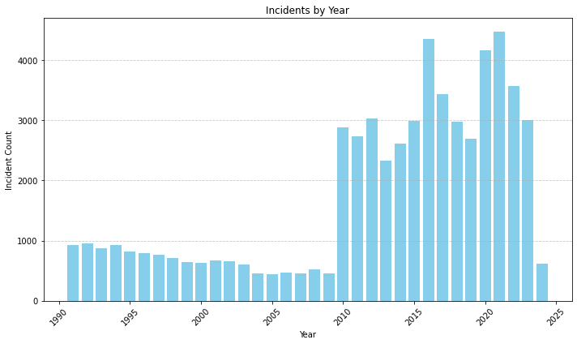
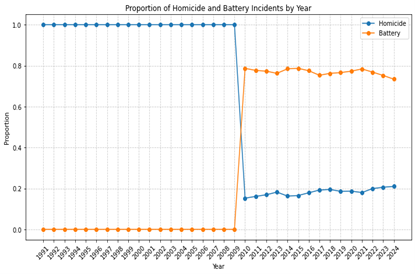
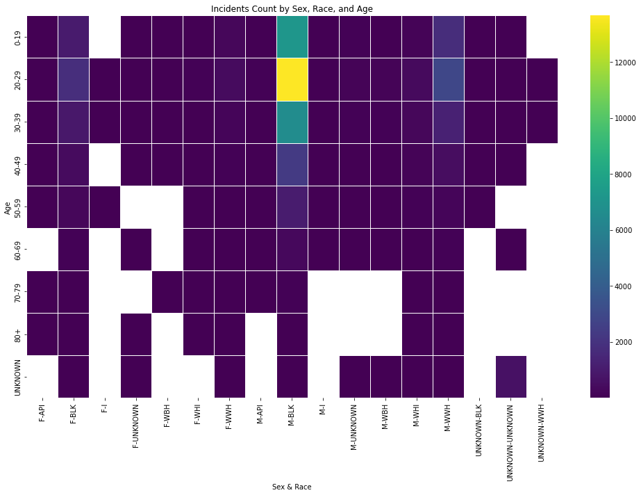
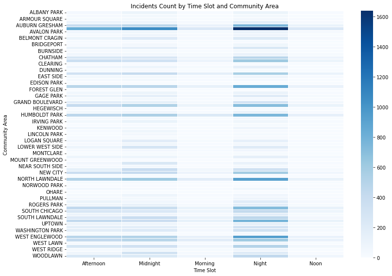

# Gun_violence_analysis
This repository is an analysis of the victims of gun violence in Chicago.It aims to analyz characteristics of victims and the time and locations of shooting cases.So better ways for future prevention can be provided based on that

Input:1.[the record of shooting cases in Chicago](Victims.csv),it can be obtained from DATA.GOV

2.A tiger/line shape file of Chicago, can be obtained from US Census Bureau.

Output:1.Python figures 2. One QGIS map

[here](analyze.py) is the python script

The script provides an overview of dataset at fist.First graph shows the number of shooting cases grouped by year:

and the second graph shows the proportion of two types of shooting cases:

There are no records of Battery type of shooting cases before 2010 . So the data before the 2010 may missed some parts and to avoid the potential bias.The data before 2010 were dropped before the analyzing:[modified data](modified_file.csv)

Then the heat map here shows the victims of different of shooting cases in Chicago, the group of people with highest a gun shooting victims are M B L K group which represents the male of African American:

The QGIS map shows the places of all shooting cases in the data set, one blue point would represent one shooting case based on longitudes and latitudes provided:[QGIS](location.png)

Last figure shows the time and location of shooting cases based on time slots and community areas:

